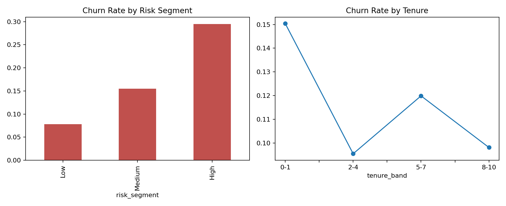

# Banking Customer Churn & Risk Analytics

## Business problem
A retail bank needs to understand which customer groups are leaving, identify interpretable churn signals and prioritize retention actions.

## Analysis
- Python/Pandas cleaning, validation and exploratory analysis
- Churn rate by tenure, activity, product holding, balance and geography
- Transparent rule-based risk segmentation for business users
- SQL CTEs, CASE expressions, aggregations and window functions
- KPI tables and dashboard charts

## Run
```bash
python -m venv .venv
# Windows: .venv\Scripts\activate
pip install -r requirements.txt
python analysis.py
```

The script generates `data/customers.csv`, KPI tables and an executive chart. Data is synthetic, reproducible and contains no real customer information.

## Dashboard Preview


