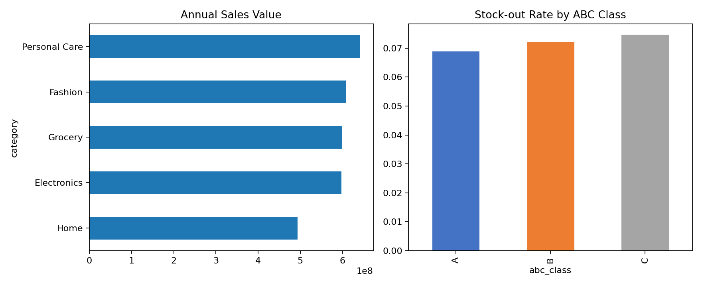

# Supply Chain, Inventory & Sales Analytics

## Business problem
Operations teams need to reduce stock-outs and excess inventory while monitoring demand, inventory turnover and supplier performance.

## Analysis
- Python/Pandas data cleaning, demand analysis and inventory KPI calculations
- Stock-out rate, days of inventory and inventory turnover
- ABC classification and slow-/fast-moving SKU analysis
- Supplier on-time delivery and defect-rate comparison
- SQL CTEs, CASE expressions, joins and window functions

## Run
```bash
python -m venv .venv
# Windows: .venv\Scripts\activate
pip install -r requirements.txt
python analysis.py
```

The script generates synthetic SKU-level data, output tables and a dashboard chart. It uses a fixed seed and contains no confidential company data.

## Dashboard Preview


